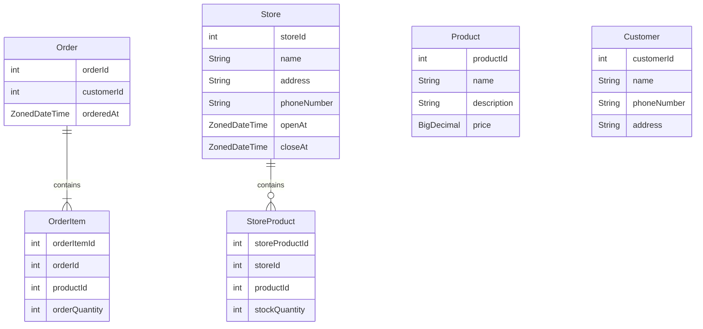

## 액터 (Actor)

### 사용자 (User)

- 사용자는 하나의 장바구니를 가질 수 있다.
- 사용자는 1개 이상의 상품을 장바구니에 담고, 삭제할 수 있다.
- 사용자는 원하는 수량만큼 상품을 장바구니에 담을 수 있다.
- 사용자는 장바구니 단위로 주문을 할 수 있다.

### 매장 (Store)

- 매장은 주문이 들어오면 매장에서 제공할 수 있는 재고가 존재하는지 확인한다.
  - 만약 주문 내 하나의 상품이라도 품절인 경우에는 주문을 취소한다.
  - 주문이 성공하면 매장 내 재고 개수를 조정한다.

## ERD



## Local MySQL

```
# mysql image 가져오기
$ docker pull mysql

# docker run
$ docker run --name localmysql -e MYSQL_ROOT_PASSWORD=coffee -p 3306:3306 -d mysql:latest
```
